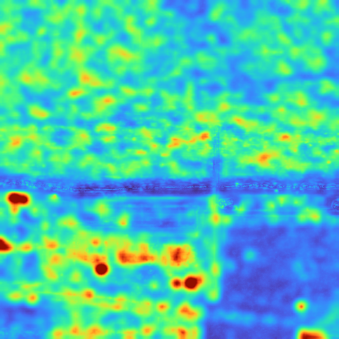

# fssimu2

Fast [SSIMULACRA2](https://github.com/cloudinary/ssimulacra2/tree/main)
derivative implementation in Zig.

## Usage

```sh
fssimu2 | [version]

usage:
  fssimu2 [options] <reference> <distorted>

options:
  --json               output result as json
  --err-map <out>      save error map to .png/.tga
  -h, --help           show this help
  -v, --version        show version information

sRGB PNG, PNM/PAM, QOI, JPEG, WebP, AVIF, or Y4M input expected
```

Example output:

```sh
$ ./fssimu2 ref.png dst.png
79.83781132
```

## Performance

Performance tested on the Intel Core i7 13700k using a 3840x2160 test image. The
numbers indicate that this implementation is up to 40% faster (~30% lower wall
clock time) and uses almost 45% less memory compared to the
[reference implementation](https://github.com/cloudinary/ssimulacra2). PAM
images are raw RGB with a simple header, so image decode time isn't factored
into this benchmark.

```
poop "ssimulacra2 medium.pam i.pam" "./fssimu2 medium.pam i.pam"
Benchmark 1 (9 runs): ssimulacra2 medium.pam i.pam
  measurement          mean ± σ            min … max           outliers         delta
  wall_time           615ms ± 12.4ms     601ms …  637ms          0 ( 0%)        0%
  peak_rss           1.30GB ± 1.65MB    1.30GB … 1.31GB          1 (11%)        0%
  cpu_cycles         2.83G  ± 42.9M     2.80G  … 2.92G           0 ( 0%)        0%
  instructions       6.61G  ± 21.9M     6.57G  … 6.62G           2 (22%)        0%
  cache_references    113M  ±  664K      112M  …  114M           2 (22%)        0%
  cache_misses       65.5M  ±  296K     64.9M  … 65.7M           0 ( 0%)        0%
  branch_misses       198K  ± 25.2K      164K  …  220K           0 ( 0%)        0%
Benchmark 2 (12 runs): ./fssimu2 medium.pam i.pam
  measurement          mean ± σ            min … max           outliers         delta
  wall_time           429ms ± 9.27ms     419ms …  447ms          0 ( 0%)        ⚡- 30.2% ±  1.6%
  peak_rss            722MB ±  146KB     721MB …  722MB          1 ( 8%)        ⚡- 44.6% ±  0.1%
  cpu_cycles         2.03G  ± 40.3M     2.00G  … 2.11G           2 (17%)        ⚡- 28.3% ±  1.3%
  instructions       4.26G  ± 3.76M     4.26G  … 4.27G           0 ( 0%)        ⚡- 35.5% ±  0.2%
  cache_references   73.9M  ±  170K     73.6M  … 74.1M           2 (17%)        ⚡- 34.6% ±  0.4%
  cache_misses       34.2M  ±  479K     33.2M  … 34.7M           2 (17%)        ⚡- 47.8% ±  0.6%
  branch_misses       180K  ± 14.9K      166K  …  203K           0 ( 0%)          -  8.9% ±  9.3%
```

Conformance to the reference SSIMULACRA2 implementation can be tested with
`validate.py` by supplying the `fssimu2` binary.

`validate.py` requires [`uv`](https://docs.astral.sh/uv/) and
[`libjxl`](https://github.com/libjxl/libjxl).

```sh
validate.py --custom ~/git-cloning/fssimu2/zig-out/bin/fssimu2 ~/git-cloning/gb82-image-set/png/*
```

Output on the [gb82 image set](https://github.com/gianni-rosato/gb82-image-set)
invoking the above command:

```
SAMPLES: 75
LEVELS: 1.0 2.0 4.0

== custom vs ref ==
 pairs: 75
 ref mean: 77.5166  std: 10.6811
 custom mean: 77.0059  std: 11.1468
 mean diff (other - ref): -0.510732
 diff stddev: 0.542364
 diff stderr: 0.0626268
 percentage error (mean diff / ref mean): 0.659%
 max absolute error: 1.90087

== correlation ==
 PCC (Pearson): 0.999676
 SRCC (Spearman): 0.999061
 KRCC (Kendall): 0.982703
```

## Error Map

The library optionally allows specifying an error map output image as either an
uncompressed `.tga` (Targa) or PNG.

Error maps use the
[Turbo](https://research.google/blog/turbo-an-improved-rainbow-colormap-for-visualization/)
color map for error visualization, which emphasizes visually obvious errors
well.

An example output is provided here, generated using
`./fssimu2 --err-map map.png ref.png dst_bad.png` which resulted in a score of
`49.37005220`.



## Compilation

Compilation requires:

- Zig (version [0.15.x](https://ziglang.org/download/0.15.2/release-notes.html))
- [libjpeg-turbo](https://libjpeg-turbo.org)
- [libwebp](https://chromium.googlesource.com/webm/libwebp)
- [libavif](https://github.com/AOMediaCodec/libavif)

Build locally:

```sh
zig build --release=fast
```

The binary will emit to `zig-out/bin/fssimu2`. The library will emit to
`zig-out/lib/libssimu2.so` (or `.dylib` on macOS, `.dll` on Windows) and the
include will be copied to `zig-out/include/ssimu2.h`.

Build and install to `/usr/local/`

```sh
zig build --release=fast --prefix /usr/local
```

## Library Usage

`fssimu2` provides a C-compatible ABI with the `ssimu2.h` include file, as well
as a Zig package for use with Zig's dependency management system.

### Zig

Adding the `fssimu2` dependency allows your Zig project to make use of the
public `computeSsimu2()` in `ssimulacra2.zig`.

```zig
pub fn computeSsimu2(
    allocator: std.mem.Allocator,
    reference: []const u8,
    distorted: []const u8,
    width: u32,
    height: u32,
    channels: u32,
    error_map: ?[]u32,
) Ssimu2Error!f64 {
...
```

In order to add it to your project, follow the steps below.

1. Run one of the following commands:
   ```sh
   # Pull from latest `main`
   zig fetch --save https://github.com/gianni-rosato/fssimu2/archive/refs/heads/main.tar.gz
   # Pull from a specific tag
   zig fetch --save https://github.com/gianni-rosato/fssimu2/archive/refs/tags/0.2.0.tar.gz
   ```

2. Add these lines somewhere in the `build()` function in `build.zig` to expose
   the module to the build system:
   ```zig
   const fssimu2 = b.dependency("fssimu2", .{
       .target = target,
       .optimize = optimize,
   });
   ```

3. Link the module to your library or binary:
   ```zig
   bin.root_module.addImport("fssimu2", fssimu2.module("fssimu2"));
   bin.linkLibrary(fssimu2.artifact("ssimu2"));
   // ^ Put these before `b.installArtifact(bin);`
   ```

Now, you can import the SSIMULACRA2 computation like so:

```zig
const fssimu2 = @import("fssimu2");
```

### C

Once you've compiled and installed `fssimu2`, include the header in any relevant
file to get started:

```c
#include <ssimu2.h>
```

The exposed functionality is as follows:

```c
// Compute a SSIMULACRA2 score
// The caller must ensure that the reference and distorted buffers
// are at least (width * height * channels) bytes long. If not,
// could lead to UB in ReleaseFast
int ssimulacra2_score(
    const uint8_t *reference,
    const uint8_t *distorted,
    const unsigned width,
    const unsigned height,
    const unsigned channels,
    double *out_score
);

// Compute a SSIMULACRA2 score with distortion map
// The caller must ensure that the reference and distorted buffers
// are at least (width * height * channels) bytes long.
// The error_map buffer must be at least (width * height * 4) bytes long
// and will be filled with RGBA values representing the distortion map.
int ssimulacra2_score_with_map(
    const uint8_t *reference,
    const uint8_t *distorted,
    const unsigned width,
    const unsigned height,
    const unsigned channels,
    double *out_score,
    uint32_t *error_map
);
```

Builds will require `-lssimu2` passed to the compiler.

### Example Usage

An example C program is provided in the `c_abi_example/` directory, featuring a
simple PAM decoder and SSIMULACRA2 computation. See the `test.c` file for usage.

In order to build the test example, enter the `c_abi_example/` dir and run:

```sh
cc test.c pam_dec.c -I../zig-out/include -L../zig-out/lib -lssimu2 -o test
# Set library path for Linux
LD_LIBRARY_PATH=../zig-out/lib ./test ref.pam dst.pam
# Set library path for macOS
DYLD_LIBRARY_PATH=../zig-out/lib ./test ref.pam dst.pam
```

For the error map example, enter the `c_abi_example/` dir and run:

```sh
cc test_with_map.c pam_dec.c -I../zig-out/include -L../zig-out/lib -lssimu2 -o test_map
# Set library path for Linux
LD_LIBRARY_PATH=../zig-out/lib ./test_map ref.pam dst.pam
# Set library path for macOS
DYLD_LIBRARY_PATH=../zig-out/lib ./test_map ref.pam dst.pam
```

When fssimu2 is properly installed system-wide, the library path specifier isn't
needed.

## License

This project is under the Apache 2.0 license. More details in
[LICENSE](./LICENSE).

This project uses code from [libspng](https://libspng.org),
[libminiz](https://github.com/richgel999/miniz), and
[vapoursynth-zip](https://github.com/dnjulek/vapoursynth-zip). Special thanks to
the authors. Licenses for third party code are included in the `legal/` folder.
